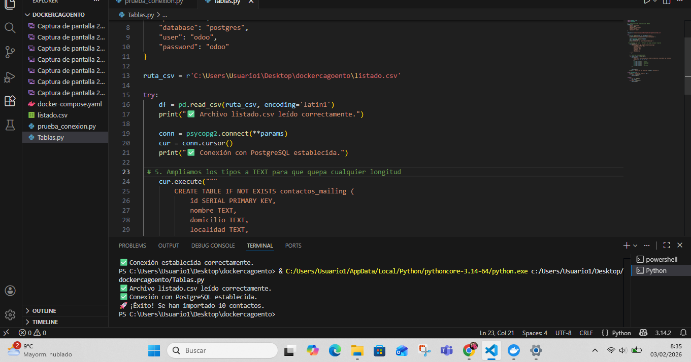
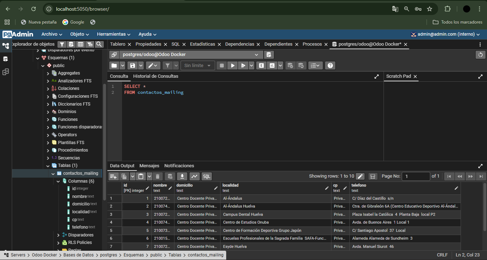

# PostgreSQL-PYTHON

## Descripción

Script de Python para importar datos de un archivo CSV a una base de datos PostgreSQL que se ejecuta en Docker junto con Odoo. El proceso actúa como un ETL (Extracción, Transformación y Carga) automatizado.

---

## Estructura del repositorio

```
PostgreSQL-PYTHON/
├── docker-compose.yaml      # Configuración de contenedores (PostgreSQL, Odoo, pgAdmin)
├── prueba_conexion.py       # Script de verificación de conexión
├── Tablas.py                # Script principal: crea tabla e importa datos del CSV
├── listado.csv              # Archivo de datos fuente (centros educativos)
├── Conexion_Exitosa.png     # Captura: ejecución exitosa del script
├── Resultado_Postgre.png    # Captura: datos visibles en pgAdmin
└── README.md                # Este archivo
```

---

## Tecnologías utilizadas

- **Python 3** — Lenguaje de programación
- **pandas** — Lectura y manipulación del archivo CSV
- **psycopg2** — Conector de Python con PostgreSQL
- **Docker Desktop** — Contenedorización de los servicios
- **pgAdmin** — Administrador visual de PostgreSQL

---

## Configuración del entorno

### 1. Requisitos previos

- Tener instalado **Docker Desktop** y que esté en ejecución
- Tener instalado **Python 3.10+**
- Instalar las librerías necesarias:

```bash
pip install pandas psycopg2-binary
```

### 2. Levantar los contenedores

Desde la carpeta del proyecto, ejecutar en la terminal:

```bash
docker-compose up -d
```

Esto levanta tres contenedores:

| Contenedor | Servicio     | Puerto         |
|------------|--------------|----------------|
| db         | PostgreSQL   | 5432           |
| odoo       | Odoo         | 8200 (web)     |
| pgadmin    | pgAdmin      | 5050 (web)     |

Verificar que están activos:

```bash
docker ps
```

### 3. Verificar la conexión

Ejecutar el script de prueba:

```bash
python prueba_conexion.py
```

Si la conexión es correcta aparece:

```
 Conexión establecida correctamente.
```

### 4. Ejecutar la importación

Ejecutar el script principal desde la misma carpeta donde está el `listado.csv`:

```bash
python Tablas.py
```

Mensajes esperados en la terminal:

```
 Archivo listado.csv leído correctamente.
 Conexión con PostgreSQL establecida.
 ¡Éxito! Se han importado 10 contactos.
```

### 5. Verificar en pgAdmin

Abrir el navegador en `localhost:5050` e iniciar sesión con:

- **Email:** admin@admin.com
- **Contraseña:** admin

Añadir el servidor con estos datos:

| Campo                          | Valor      |
|--------------------------------|------------|
| Nombre/dirección del host      | db         |
| Puerto                         | 5432       |
| Base de datos de mantenimiento | postgres   |
| Nombre de usuario              | odoo       |
| Contraseña                     | odoo       |

Una vez conectado, navegar a **Databases → postgres → Schemas → public → Tables → contactos_mailing** y ejecutar:

```sql
SELECT * FROM contactos_mailing;
```

---

## Capturas de pantalla

### Ejecución exitosa del script en VS Code



### Datos importados visibles en pgAdmin



---

## Credenciales del entorno

| Servicio   | Usuario         | Contraseña | Puerto |
|------------|-----------------|------------|--------|
| PostgreSQL | odoo            | odoo       | 5432   |
| pgAdmin    | admin@admin.com | admin      | 5050   |

---

## Autor

**AlejandroBou**
